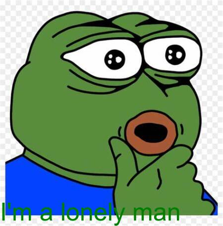

```{r setup, include=FALSE}
knitr::opts_chunk$set(echo=TRUE, message=FALSE, warning=FALSE, error=FALSE)
```

```{css}
p {
  font-size: 32px;
}
```

## Project requirements

```{r,echo=FALSE , out.width="50%"}

```

In order to meet these requirements, I first went to learn more about how to use GitHub. By looking up materials, I learned how to create a repository on GitHub and upload project files. I used GitHub to showcase the repository and website and provided two different links, one to my photo library and the other to the website.

In the GitHub repository, I used Markdown for documentation. I have provided screenshots showing the process of setting up and using GitHub in RStudio, as well as the research work environment and workflow for this project. In addition, I have shown all the files and images used for this project.

To better manage your project, you learned how to use git commands in RStudio to commit and push changes to GitHub. This way, I can ensure that the project is updated and version controlled.

With the above steps, these requirements were successfully met and a complete project, including repository and website, was set up on GitHub. This not only showcases the results of my work, but also provides a convenient way to share and collaborate with others.

## My meme

```{r meme-code, eval=TRUE}
library(magick)
library(dplyr)
blank_image <- image_blank(width = 200, height = 300)
meme <- image_read("https://tse1-mm.cn.bing.net/th/id/OIP-C.5ptl2rylkcS74UCjL1IGggHaHf?rs=1&pid=ImgDetMain")
meme
meme <- meme %>% image_scale(., "x455") %>% 
  image_append() %>% 
  image_annotate("I'm a lonely man", size = 50,
                 gravity = "southwest", color = "green") 
meme
```

```{r}
meme %>% image_write(path = "my_meme.png")
```


```{r animation-code, eval=FALSE}
meme <- image_read("https://tse1-mm.cn.bing.net/th/id/OIP-C.5ptl2rylkcS74UCjL1IGggHaHf?rs=1&pid=ImgDetMain")
animation1 <- image_rotate(meme, 90)
animation2 <- image_rotate(meme, 60) %>% 
  image_border("red", "20x20")
animation3 <- image_rotate(meme, 70) 
animation4 <- meme %>% 
  image_background("blue", flatten = TRUE) %>% 
  image_border("red", "10x10") %>% 
  image_annotate("Frog meme", size = 40,
                 gravity = "southwest", color = "blue",
                 style = "normal",
                 location = "+30+30")
animation <- image_resize(c(animation1,animation2,animation3,animation4),
             '450x450!') |>
  image_background('white') |>
  image_morph() |>
  image_animate(optimize = TRUE) 
animation %>% image_write("my_animation.gif")
```

## Creativity
  
"Creativity" means demonstrating innovative thinking and individualized problem-solving skills in project execution. It involves going beyond standard or traditional practices to add value by introducing novel approaches, unique perspectives, or original solutions. In a programming or technical project, "demonstrating creativity" means using existing tools or libraries to solve problems in non-traditional ways, adding unique style and personalization to the implementation of features.

For projects that use the magick package, ways to demonstrate creativity might include:

Use the additional features of the magick package creatively, such as manipulating complex images, generating gifs, or creating unique visual effects.

Developing new CSS styles to improve the look and feel of the site and the user experience goes beyond the basics taught in lectures or lab courses.

## Learning reflection

In working with Rmarkdown, you learned a valuable skill - using CSS and HTML to enhance the visual appeal of Rmarkdown documents. In this process, I realized that incorporating modern HTML technology can not only bring documents to life, but also make them interactive. I learned to use CSS to fine-tune document styles, including font changes, color matching and layout optimization. At the same time, I also mastered the essence of HTML, and could easily embed pictures, videos and animations to make documents more colorful.

Not only that, but my understanding of data technology has also deepened. We are keen to explore the applications of Rmarkdown for data analysis and visualization, and how its flexibility can be harnessed to produce professional-grade reports and presentations. This experience has undoubtedly improved my data processing skills and deepened my passion for further exploration of data technology.